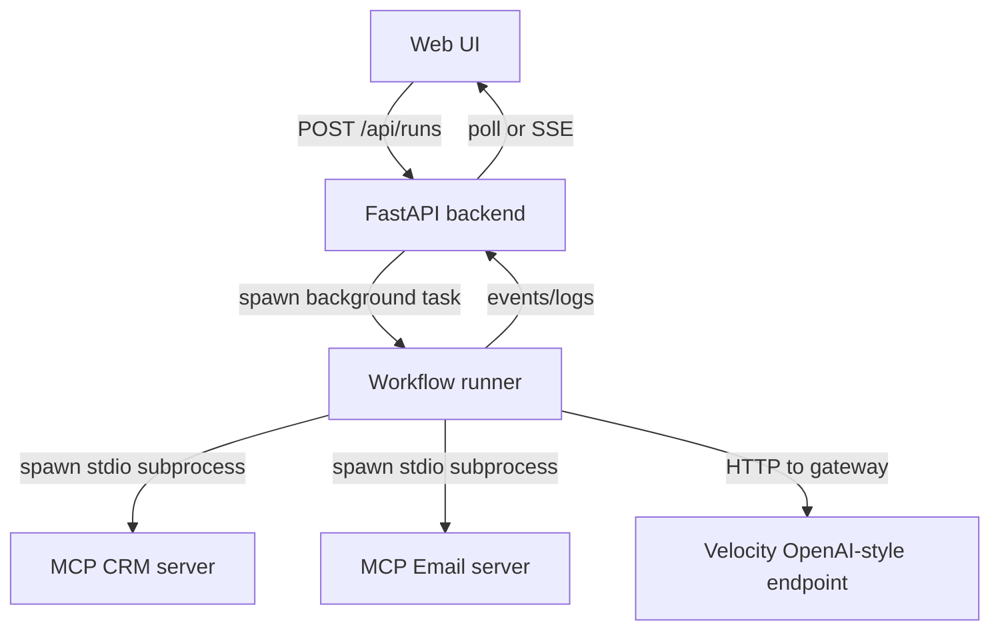

# Plan: Module 6.2 / 6.3 Lab Compliance + Web UI

## 1) Criteria audit (current repo)

### 6.2 Hands-on Lab 3: Autonomous Operations Agent (MCP)
- ✅ Multiple mock business systems via MCP: [`crm_server.py`](crm_server.py) and [`email_server.py`](email_server.py)
- ✅ Host orchestrator exists: [`host_agent.py`](host_agent.py)
- ✅ Prompt is exactly: `Process new order #XYZ-789.` (currently hard-coded in [`_run_agent()`](host_agent.py:179))
- ✅ Intended autonomous flow: CRM lookup then email send (tool loop exists)
- ⚠️ Host currently uses a direct HTTP call with Velocity gateway (not OpenAI SDK as the lab text says). This is acceptable for “Velocity gateway” demo, but for 6.3 step 3 we should provide an OpenAI-SDK implementation variant.

### 6.3 Guided coding steps
1. Build CRM server from scratch
   - ✅ We have a working CRM server with `getCustomerEmail(order_id)` in [`crm_server.py`](crm_server.py)
   - 🔧 To match teaching, add a `labs/` folder with a “starter” CRM server for participants (minimal skeleton) and keep current file as “solution”.
2. Use pre-built email server
   - ✅ [`email_server.py`](email_server.py) exists and is simple.
3. Build host using OpenAI SDK
   - ⚠️ Current host is gateway-specific HTTP using httpx.
   - 🔧 Add an alternate host implementation using OpenAI SDK (keeping the current host working).
4. Only prompt: `Process new order #XYZ-789.`
   - ✅ Already satisfied.
5. Showcase autonomous tool calls via MCP
   - ✅ Already satisfied conceptually.
   - 🔧 Ensure tool naming matches OpenAI tool name constraints (already sanitized), and add deterministic logging for demo.

## 2) Proposed implementation approach

### A) Keep two host paths (recommended)
- Path 1: Gateway HTTP (current) for Velocity environments.
- Path 2: OpenAI SDK host (new) for strict alignment with lab wording.

Both hosts share:
- MCP server spawning
- Tool discovery
- Tool loop

Refactor common logic into a reusable module (so UI can call it too).

### B) Add a web UI that runs the workflow
Goal: one command starts a local web app, user clicks “Process order” and sees streaming logs + final summary.

Approach:
- Backend: FastAPI + Uvicorn
- Frontend: minimal HTML + JS (fetch + SSE or polling)

Suggested API:
- `POST /api/runs` -> starts a background run, returns `{run_id}`
- `GET /api/runs/{run_id}` -> returns `{status, logs[], final}`
- Optional: `GET /api/runs/{run_id}/events` (SSE) for live streaming

## 3) File changes (spec)

### New files
- `app/web_app.py`: FastAPI app, background task manager, run registry
- `app/run_workflow.py`: shared workflow runner (spawns MCP servers, loops tool calls)
- `app/templates/index.html` or `app/static/index.html`: UI
- `app/static/app.js`: UI logic
- `app/static/styles.css`: optional
- `labs/crm_server_starter.py`: starter scaffold for participants
- `labs/host_agent_openai_starter.py`: starter scaffold (OpenAI SDK)
- `labs/host_agent_openai_solution.py`: reference solution (OpenAI SDK)

### Modified files
- [`requirements.txt`](requirements.txt): add `fastapi`, `uvicorn`, and `openai` (for the OpenAI SDK host variant)
- [`README.md`](README.md): update run instructions (CLI + web)
- Potentially refactor [`host_agent.py`](host_agent.py) to call shared runner code.

## 4) Architecture / flow

## 5) Acceptance checks
- `python -m compileall -q .`
- CLI demo:
  - `python host_agent.py` prints tool calls and final summary.
- Web demo:
  - `uvicorn app.web_app:app --reload`
  - Visit `/` and click run, see:
    - CRM tool called with `XYZ-789`
    - Email tool called
    - Final summary displayed

## 6) Open questions / user decisions
- UI streaming: polling (simpler) vs SSE (nicer UX). Default: polling.
- Host selection in UI: gateway-http host vs OpenAI SDK host. Default: gateway-http (since it matches your Velocity environment).
