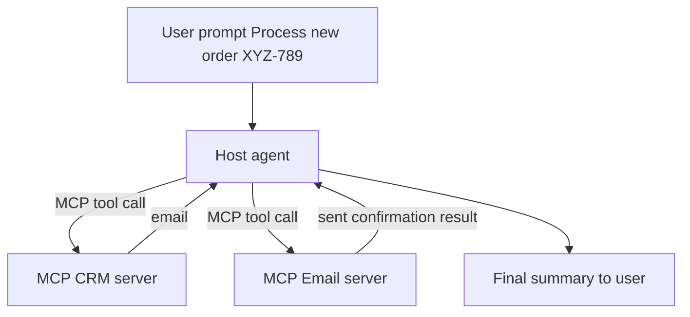

# Module 6 Implementation Plan — Autonomous Operations Agent with MCP (Python)

## Goals
Build a runnable Python demo that teaches the MCP concept end-to-end:

- Two **MCP servers** (stdio transport)
  - [`crm_server.py`](crm_server.py) exposes tool: `getCustomerEmail(order_id)`
  - [`email_server.py`](email_server.py) exposes tool: `sendShippingConfirmation(email, order_details)`
- One **Host agent** [`host_agent.py`](host_agent.py) that:
  - Receives only: `Process new order #XYZ-789.`
  - Autonomously calls CRM tool to fetch email
  - Autonomously calls Email tool to send shipping confirmation
  - Uses OpenAI SDK against your work gateway (`VELOCITY_BASE_URL=https://chat.velocity.online`)

## Key design choices

### MCP implementation choice
Use the official MCP Python SDK over stdio:
- Matches the real protocol used in production tooling.
- Keeps the lab aligned with the “USBC for Agents” messaging.
- Lets learners focus on “wrapping tools” + “host orchestration” rather than re-implementing JSON-RPC.

### Transport choice
Use stdio servers:
- Runs locally without ports, firewalls, or service discovery.
- Easy to launch in separate terminals (and easiest to debug for learners).

## Repo layout

- [`crm_server.py`](crm_server.py): MCP server #1
- [`email_server.py`](email_server.py): MCP server #2
- [`host_agent.py`](host_agent.py): host agent
- [`config.py`](config.py): `.env` loading + base URL normalization
- [`requirements.txt`](requirements.txt): Python dependencies
- [`README.md`](README.md): run instructions and troubleshooting
- [`plans/module6_mcp_autonomous_ops_plan.md`](plans/module6_mcp_autonomous_ops_plan.md): this plan

## Environment and configuration

### `.env` (existing)
You already have:
- `VELOCITY_API_KEY=...`
- `VELOCITY_BASE_URL=https://chat.velocity.online/?model=...`
- `VELOCITY_MODEL=gpt-5.2`

### Normalization rules (to avoid base URL bugs)
In [`config.py`](config.py):
- Parse `VELOCITY_BASE_URL`
- **Strip query params** (your current value contains `?model=...`)
- Keep only `scheme://host[:port]` and optional path *only if it is an API prefix*
- Ensure the OpenAI-compatible client ultimately targets:
  - base URL `https://chat.velocity.online` and the SDK appends `/v1` where needed
  - if the SDK requires it, we will set base URL to `https://chat.velocity.online/v1`

We will include a startup diagnostic print:
- Effective base URL
- Effective model
- Which endpoint the SDK is using (`responses` vs `chat.completions`)

### Python dependencies to add
In [`requirements.txt`](requirements.txt):
- `mcp` (official MCP Python SDK)
- `openai` (OpenAI Python SDK)
- `python-dotenv` (load `.env`)

## Detailed flow (what the agent does)

## Server specs

### CRM server (`getCustomerEmail`)
- Input schema:
  - `order_id: str`
- Output schema:
  - `email: str`
  - optionally: `customer_id: str`, `name: str` (for richer demo)
- Backing store:
  - in-memory dict mapping `order_id` -> email
  - include `XYZ-789 -> customer@example.com` deterministically

### Email server (`sendShippingConfirmation`)
- Input schema:
  - `email: str`
  - `order_details: str` (or structured object)
- Behavior:
  - Simulate sending by printing/logging
  - Return `status: sent` and a mock `message_id`

## Host agent specs

### Prompting
System instruction:
- You are an autonomous operations agent. Use available tools via MCP to complete the order.

User message:
- `Process new order #XYZ-789.`

### Tool connection
Host launches/attaches to MCP stdio servers:
- Start command for CRM: `python crm_server.py`
- Start command for Email: `python email_server.py`

### Tool calling strategy
- Host requests available tools from each MCP server.
- The LLM chooses tool calls.
- Host executes MCP tool calls and feeds results back to the LLM.

### Output
Host prints:
- Steps taken (high-level)
- Tool calls made (names + args)
- Final human-readable confirmation

## Runbook (what learners do)

1. Create venv, install deps
2. Terminal A: run CRM server
3. Terminal B: run Email server
4. Terminal C: run host agent

We will add a convenience option (optional): a single `python host_agent.py` mode that spawns both servers as subprocesses for fully one-command demo.

## Troubleshooting checklist (base URL + auth)

- If you see 404:
  - base URL likely points to UI route instead of API root
  - ensure query params are stripped
  - try forcing `/v1` in config
- If you see 401/403:
  - verify `.env` loaded
  - verify `VELOCITY_API_KEY` is passed as API key
- If model not found:
  - ensure `VELOCITY_MODEL=gpt-5.2` matches gateway naming

## Implementation sequence (high-confidence)
1. Add scaffolding files and dependencies.
2. Implement servers first (no OpenAI dependency).
3. Implement host agent.
4. Add diagnostics and the one-command runner.
5. Verify expected output transcript.
